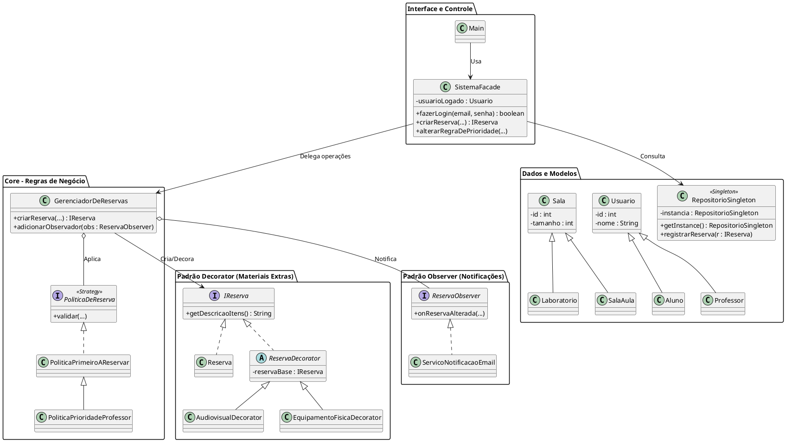

# 🏛️ Documentação de Arquitetura (ARCHITECTURE.md)

Este documento descreve a arquitetura de software, as decisões de design e os padrões de projeto (_Design Patterns_) aplicados no **Sistema de Reserva de Salas**. O sistema foi construído em Java puro, sem frameworks externos, com forte ênfase nos princípios SOLID e na separação de responsabilidades (Alta Coesão e Baixo Acoplamento).

---

## 1. Visão Geral em Camadas

O sistema está estruturado conceitualmente em três camadas principais:

1.  **Camada de Apresentação / Interface (`Main.java`):** Responsável exclusivamente por interagir com o usuário via terminal (I/O). Esta camada não conhece as regras de negócio complexas, comunicando-se com o sistema apenas através da Facade.
2.  **Camada de Aplicação / Regras de Negócio (`SistemaFacade.java`, `GerenciadorDeReservas.java`, Padrões GoF):** O "coração" do sistema. Orquestra a criação de reservas, validações de segurança, aplicação de regras de conflito e adição de materiais extras.
3.  **Camada de Dados / Persistência (`RepositorioSingleton.java`):** Um banco de dados em memória que gerencia as listas de instâncias de `Usuario`, `Sala` e `IReserva`.

---

## 2. Padrões de Projeto (Design Patterns GoF)

A arquitetura faz uso de 6 Padrões de Projeto clássicos do _Gang of Four_ para resolver problemas específicos de design:

### 2.1. Singleton (`RepositorioSingleton.java`)

- **Problema:** Garantir que todas as partes do sistema consultem e alterem as mesmas listas de usuários, salas e reservas, evitando inconsistência de dados durante a execução.
- **Solução:** Implementação do padrão Singleton utilizando _Double-Checked Locking_ e a palavra-chave `volatile`. Isso garante uma instância única e segura para _threads_ (thread-safe). O acesso aos dados é protegido pelo retorno de listas não-modificáveis (`Collections.unmodifiableList`).

### 2.2. Factory Method (`SalaFactory.java`)

- **Problema:** A criação de diferentes tipos de salas (Laboratório, Estudo, Aula) exige configurações específicas de capacidade (tamanho) que não devem ser expostas diretamente para quem instancia.
- **Solução:** Uma interface `SalaFactory` com implementações concretas (`LaboratorioFactory`, etc.). O sistema cliente apenas solicita a criação pelo ID, e a fábrica decide qual construtor chamar e qual capacidade aplicar via `super()`.

### 2.3. Facade (`SistemaFacade.java`)

- **Problema:** A interface de usuário (`Main`) precisaria conhecer o Repositório, o Gerenciador, os Serviços de Notificação e as Políticas, tornando-se uma classe "Deus" (_God Class_).
- **Solução:** A `SistemaFacade` age como um tradutor e "leão de chácara". Ela recebe comandos simples do `Main` (como IDs numéricos) e os traduz em operações complexas de domínio, além de garantir a autenticação da sessão (`validarSessao()`).

### 2.4. Strategy (`PoliticaDeReserva.java`)

- **Problema:** O sistema possui diferentes regras para resolver choques de horário. Inserir múltiplos `if/else` no Gerenciador tornaria o código frágil e difícil de estender.
- **Solução:** Criação da interface `PoliticaDeReserva`. As regras de validação foram encapsuladas em classes separadas (`PoliticaPrimeiroAReservar` e `PoliticaPrioridadeProfessor`). O administrador pode alterar a política em tempo de execução, modificando o comportamento do sistema sem alterar o código do Gerenciador.

### 2.5. Decorator (`ReservaDecorator.java` e `IReserva.java`)

- **Problema:** Salas permitem adicionar diferentes combinações de equipamentos extras (Física, Audiovisual, Computadores). Criar uma subclasse para cada combinação (ex: `ReservaComFisica`, `ReservaComFisicaEAudiovisual`) causaria uma explosão combinatória de classes.
- **Solução:** Uso do padrão Decorator. A reserva básica e os materiais implementam a mesma interface `IReserva`. Os decoradores "envolvem" a reserva, adicionando funcionalidades dinamicamente em tempo de execução sem afetar a estrutura base.

### 2.6. Observer (`ReservaObserver.java`)

- **Problema:** O sistema precisa notificar os convidados sempre que uma reserva for alterada, mas o Gerenciador não deve ser acoplado à lógica de envio de e-mails.
- **Solução:** Implementação do padrão Observer. O `GerenciadorDeReservas` atua como _Subject_, disparando o método `onReservaAlterada`. O `ServicoNotificacaoEmail` atua como _Observer_, recebendo o alerta e executando a simulação de envio de mensagens de forma totalmente independente.

---

## 3. Diagrama UML de Classes

O diagrama abaixo ilustra as associações, heranças e a aplicação dos padrões de projeto descritos.

> **Nota:** Se a plataforma de hospedagem suportar _PlantUML_ nativamente, o código abaixo será renderizado como uma imagem. Caso contrário, copie o bloco abaixo e cole em [PlantText](https://www.planttext.com/) para visualização.

